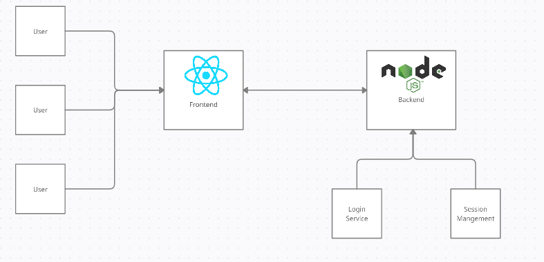

# Session

Full stack educational portal and video conferencing app toy project. This project is created for educational and training purposes and as such is not fit for real world usage (I mean check the demo).

# Tech Stack

Frontend: React
Backend: NodeJS + ExpressJS
Technologies: WebRTC (through PeerJS), Socket.io
Database: MongoDB (through mongoose).

# System Architecture

# Demo

